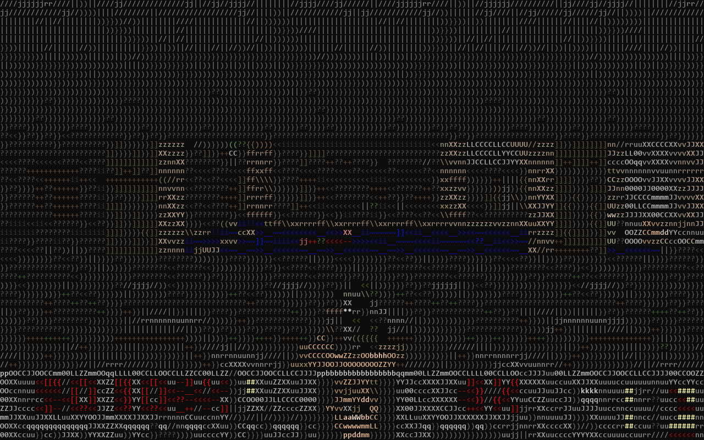
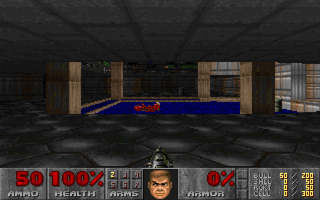

# Luckfox Doom

**A tiny board. A terminal. Doom.**

Play Doom over SSH on the **Luckfox Pico Plus (RV1103)**. The board runs the game;
your computer displays the graphics and sends keyboard input. Choose ASCII or real pixels.



*Captured from a live 160 x 52 SSH terminal on the board; the received ANSI frame
is rendered here as a PNG. No desktop or display server is involved.*

- About **422 KiB** for the executable and **4 MiB** for the shareware episode.
- Automatically fits your terminal, with brighter colours and clean exit handling.
- Runs on the tested Buildroot image without rebuilding Linux or adding runtime packages.
- Based on [doom-ascii](https://github.com/wojciech-graj/doom-ascii), with its source and attribution preserved.

## Get started

Follow the **[installation guide](docs/INSTALL.md)** to build, copy, and launch the game
from Linux, WSL, or Windows. You need a working SSH connection to the board.

Once installed:

```sh
ssh -t root@luckfox doom
```

Replace `luckfox` with your board's hostname or IP address. Maximize your terminal
before launching; **160 columns by 52 rows** gives the best default detail.
Smaller windows work too. Restart the game after resizing.

Jump straight into the first level:

```sh
ssh -t root@luckfox doom -warp 1 1 -skill 2
```

## Real pixels over SSH



```sh
ssh -t root@luckfox doom-pixels
```

`doom` keeps the ASCII version. `doom-pixels` uses a separate launcher and the same
engine, sending the original 320 x 200 framebuffer and 256-colour palette as Sixel.
The default 2x scale displays 640 x 400 pixels; add `-pixel-scale 1` or
`-pixel-scale 3` for 320 x 200 or 960 x 600. An optimized build measured about
21 frames/s with music and effects in E1M1;
actual speed depends on the board, network, and terminal.

Use a **Sixel-capable terminal**, such as Windows Terminal 1.22 or newer. Ordinary
SSH transports the graphics; no X forwarding is needed. Both images above were
captured from the board, with the received terminal data decoded into PNG files.

### Smooth 60-fps pixel window

For faster pixels, use the separate lossless viewer. ASCII and Sixel remain available.

```sh
python -m pip install pygame-ce
python scripts/play.py --target root@luckfox --viewer --audio
```

The board still runs Doom and synthesizes audio. The viewer receives the exact
320 x 200 indexed framebuffer and full RGB palette over SSH, then enlarges it
with integer nearest-neighbour scaling. No video compression or colour reduction.
Camera and object positions interpolate between the original 35-Hz game ticks;
gameplay, sprite animations, and moving sectors keep their original timing.
The title shows the source frame rate. E1M1 measured 60 source frames/s with
music/effects, including distinct frames while turning; demanding scenes and
connections can be slower. This is not a guarantee of 60 fps throughout every map.

Held keys work normally in this window. Close the window to disconnect, or quit
through Doom's menu. Save through the menu before closing. See the
[viewer guide](docs/INSTALL.md#lossless-pixel-viewer) for requirements and details.

## Controls

| Key | Action |
| --- | --- |
| Arrow keys | Move / turn |
| `,` / `.` | Strafe left / right |
| Space | Fire |
| E | Open / use |
| `]` | Run |
| 1-7 | Select weapon |
| Escape / Enter | Menu / select |
| Ctrl+C | Exit immediately |

Use the in-game menu to save before quitting. Audio is optional; see below.
Terminal key repeat approximates held keys, so controls feel different from a native game window.

## Music and sound effects

Install the optional SoundFont once, then play either version with streamed audio:

```sh
python scripts/fetch-soundfont.py --target root@luckfox
python scripts/play.py --target root@luckfox --pixels --audio
```

Leave out `--pixels` for ASCII. You need Python 3, OpenSSH, and `ffplay` (FFmpeg)
on your computer, plus working SSH key authentication. The board synthesizes
Doom music and mixes stereo effects; a second SSH connection sends the audio to
your computer. No USB sound card is needed. Plain `ssh -t root@luckfox doom`
and `doom-pixels` remain silent unless you add `-audio` and connect a listener.

See the **[audio setup guide](docs/INSTALL.md#music-and-sound-effects)** for details.

## Where everything lives

| Device path | Contents |
| --- | --- |
| `/usr/bin/doom` | ASCII launcher |
| `/usr/bin/doom-pixels` | Sixel pixel launcher |
| `/opt/doom/doom-ascii` | ARM executable |
| `/opt/doom/doom1.wad` | Game data |
| `/opt/doom/TimGM6mb.sf2` | Optional music instruments |
| `/opt/doom/.default.cfg` | Controls and settings |
| `/opt/doom/.savegame/` | Saved games |

## Tested setup

Luckfox Pico Plus, Buildroot 2023.02.6, Linux 5.10.160, ARMv7 hard-float,
uClibc 1.0.31. Cross-built with the Luckfox SDK's GCC 8.3 and tested through
real SSH PTYs at 160 x 52 and 80 x 25. E1M1 loads, colour frames render, and
Ctrl+C restores terminal settings. Other images and boards are not yet verified.
See [build details and checksums](docs/INSTALL.md#verified-build).

## Credits and licensing

Built on [wojciech-graj/doom-ascii](https://github.com/wojciech-graj/doom-ascii),
upstream revision `ce9f7eeb14cf1099b2a03007f919086a3a8be1e2`.
Thanks to id Software, Chocolate Doom, doomgeneric, and Wojciech Graj.
Music synthesis uses [TinySoundFont](src/third_party/README.md) (MIT) and the
separately downloaded TimGM6mb instrument bank (GPL-2).
See the [original README](README.upstream.md) and per-file copyright notices.

Source is distributed under the [GNU GPL](LICENSE). Doom game data is separately
licensed by id Software and is not included in this repository. The shareware
download helper retrieves only the first episode and verifies its checksum.
